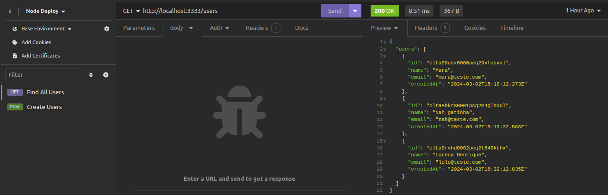
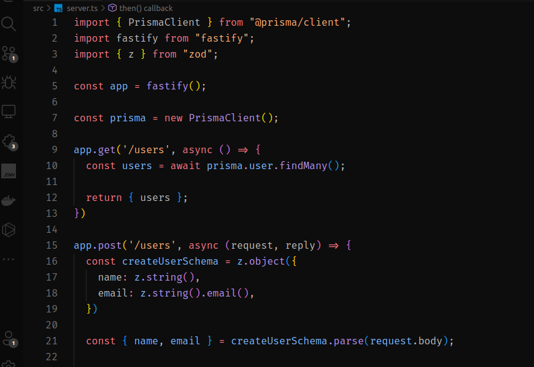

# Node.JS and Deploy

[](https://github.com/Adriano-Henrique275/node-deploy/stargazers) [](https://github.com/Adriano-Henrique275/node-deploy.svg/issues) [](https://github.com/Adriano-Henrique275/node-deploy) []([https://Adriano-Henrique275/node-deploy](https://github.com/Adriano-Henrique275/node-deploy))

Esse projeto tem o intuíto de estudos, principalmente



Foram usados para esse estudo, prisma, postgres, zop, typescript entre outras bibliotecas, o objetivo é o estudo sobre deploy.

---

## Características
- NodeJs
- Prisma
- Prisma/client
- Postgres
- Docker
- Docker Compose
- Fastify
- Test Api - Insomnia



---

### Setup

Ao efetuar o clone do projeto, efetue o comando `npm install` para instalar as bibliotécas necessárias para o projeto funcionar corretamente.

---

#### Comandos git e usando github-cli

Após efetuar o projeto iniciamos o repositório no github usando o git cli

> git/cli - auxilia e ajuda muito nos projetos, facilitando para o desenvolvedor.

```git
  git init
  git add . 
  git commit -m "initial commit" 
  gh repo create 
```
Iniciando o projeto nodeJs, e instalando as lib necessárias para o projeto
```npm
  npm install -D typescript @types/node tsx tsup
  npm i fastify
  npm i prisma -D
  npm i @prisma/client
  npm i zod
  npx prisma init
  npx tsc --init
```


  
 ✌️ &emsp; Enjoy to do programming and sharing knowledge
 ❤️ &emsp; Love to writing code and learning new features
 📧 &emsp; Reach me anytime: adriano.henrique275@gmail.com
 💬 &emsp; Ask me about anything [here](https://github.com/Adriano-Henrique275/issues)